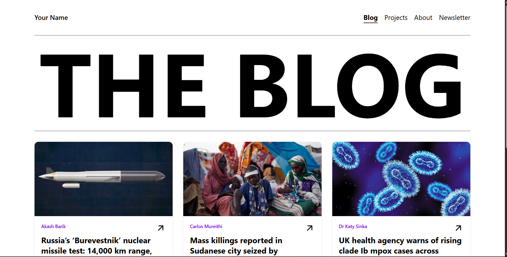
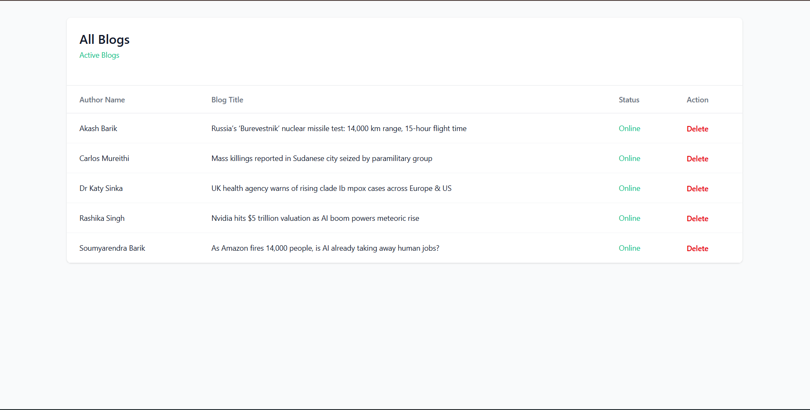
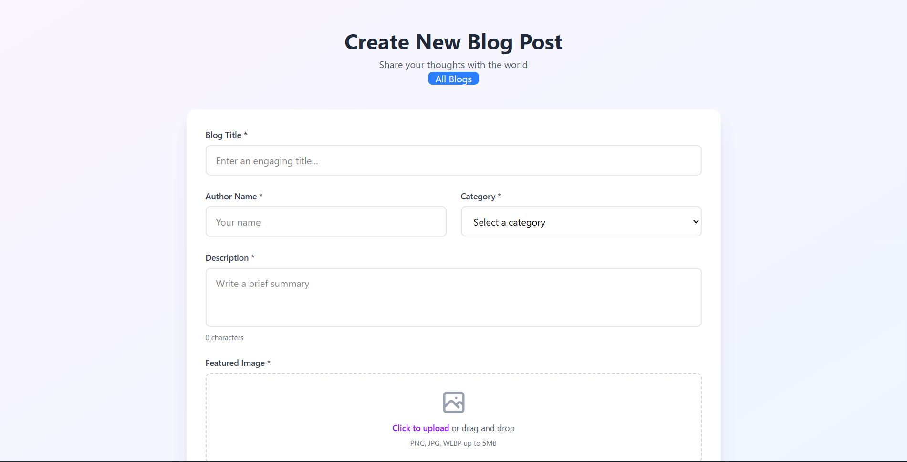

# The-Blog
This is a just blog website with minimalistic design .

## Installation

First clone it then run npm install  and all dependencies for both client and server  then npm run dev and for the backend it run on localhost:3000  for frontend  localhost:5173

## Homepage

## Admin Edit

## Admin Upload

